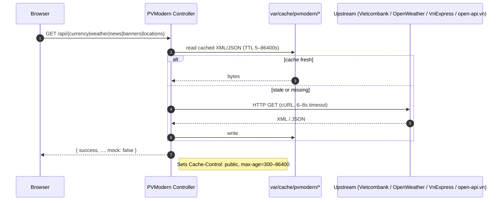
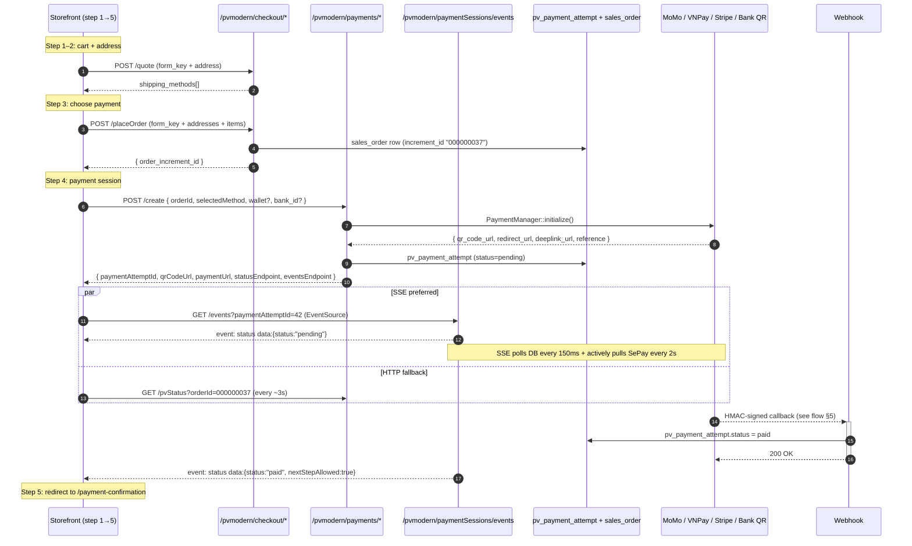
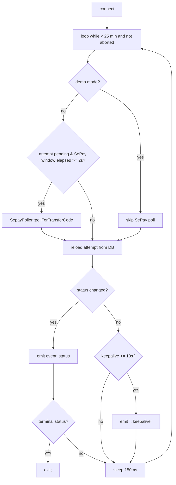
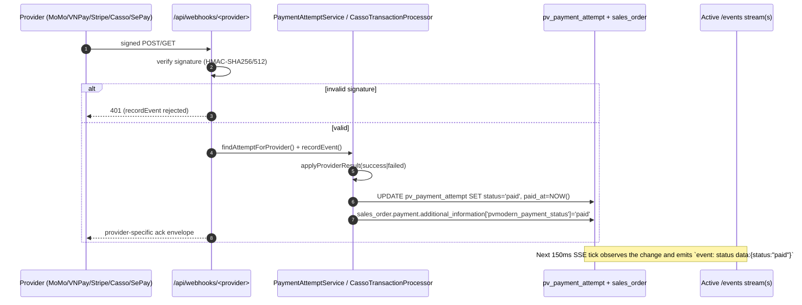
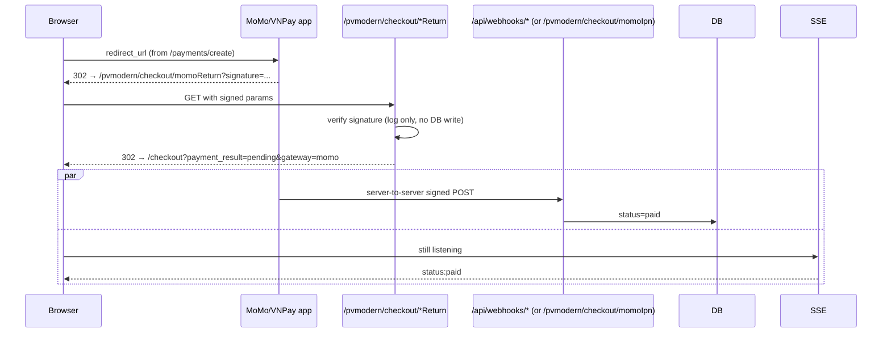
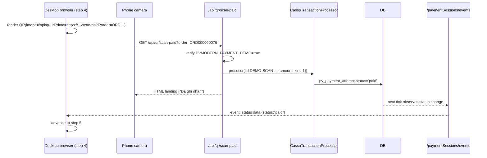
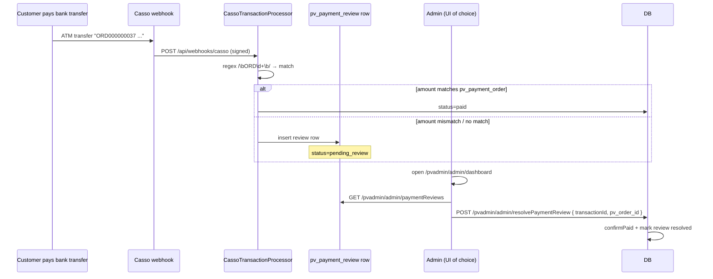
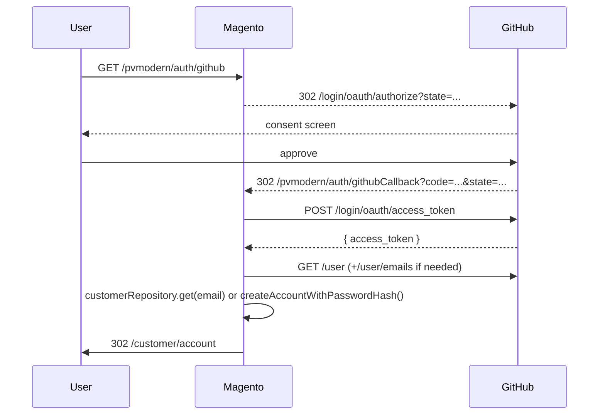

# PVModern — API Flow Documentation

This document complements [`openapi.yaml`](./openapi.yaml) (rendered via
[`swagger.html`](./swagger.html)) with end-to-end flow diagrams for the
non-obvious parts of the PVModern HTTP surface — checkout, payments, webhooks,
SSE polling, and admin review.

> Open `docs/swagger.html` in a browser to explore each endpoint
> interactively. The Mermaid diagrams below render natively in GitHub /
> GitLab / VS Code preview.

---

## 1. Route layout (frontName → controller)

PVModern registers six storefront `frontName`s plus one admin route:

| frontName | Router prefix | Purpose |
|---|---|---|
| `api` | `/api/...` | API aliases (currency, news, weather, banners, locations, qr, webhooks). Registered **before** `Magento_Webapi` so it wins. |
| `currency`, `weather`, `news`, `currency-rate` | `/currency/...` etc. | Dual-purpose: HTML page when called as a regular route, JSON when called as `/api/...`. |
| `pvmodern` | `/pvmodern/...` | Generic catch-all (`search/suggest`, `checkout/*`, `payments/*`, `paymentSessions/*`, `orders/*`, `qr/*`, `shipping/*`, `auth/*`). |
| `pvadmin` | `/pvadmin/admin/...` | Custom cookie-protected payment review dashboard. |
| `payment-confirmation`, `order-tracking` | `/payment-confirmation`, `/order-tracking` | Refresh-safe customer pages. |
| `pvmodern_payments` (adminhtml) | `/pvmodern_payments/payments/...` | Native Magento backend (ACL `YourVendor_PVModern::payments`). |

---

## 2. Storefront data dashboards

All four dashboards (currency, weather, news, banners) follow the same
pattern: upstream provider → in-process cache → JSON envelope with a
`mock: bool` flag so the frontend can show a "showing fallback data" badge.



---

## 3. Multi-step checkout & payment

The custom checkout deliberately bypasses Magento's default flow. The
storefront submits to three controllers in sequence, then **polls or
subscribes** for payment confirmation while the user pays in their wallet
app.



Key endpoints:

| Step | Endpoint | Notes |
|---|---|---|
| Quote | `POST /pvmodern/checkout/quote` | `form_key` required; returns 422 on session expiry. |
| Place order | `POST /pvmodern/checkout/placeOrder` | Creates Magento order + populates `sales_order_payment.additional_information.pvmodern_payment_context`. |
| Create session | `POST /pvmodern/payments/create` | Dispatches `bank_transfer` vs `online_gateway`; injects `wallet_id` / `bank_id` overrides; supports `selectedMethod=momo|vnpay|stripe` shorthand. |
| Poll | `GET /pvmodern/payments/pvStatus?orderId=...` | Auto-expires after 30 min; merges latest attempt status. |
| Stream | `GET /pvmodern/paymentSessions/events?paymentAttemptId=...` | `text/event-stream`; closes on terminal status. |
| Manual recheck | `POST /pvmodern/paymentSessions/retryStatusCheck` | Forces `PaymentStatusPoller::pollAttempt`. |

---

## 4. SSE polling internals

The SSE controller is the linchpin of the "instant" payment confirmation
UX. It tears down Magento's output buffers, polls the DB every 150ms, and
actively pulls SePay's UserAPI every 2 seconds as a webhook fallback:



---

## 5. Payment webhooks — provider matrix

All webhooks use the same downstream pipeline (`CassoTransactionProcessor`
for bank credits, `PaymentAttemptService::applyProviderResult` for gateway
events) but each verifies a different signature scheme:

| Endpoint | Method | Auth scheme | Hashed material |
|---|---|---|---|
| `/api/webhooks/casso` | POST | `X-Casso-Signature: t=<ms>,v1=<hex>` | HMAC-SHA512 of `<t>.<canonical_json>` (recursively key-sorted, then re-encoded with `JSON_UNESCAPED_SLASHES|JSON_UNESCAPED_UNICODE`) |
| `/api/webhooks/sepay` | POST | `Authorization: Apikey <secret>` (also `Bearer`, `X-Webhook-Secret`, `X-Sepay-Token`) | constant-time string compare; accepts live or sandbox key |
| `/api/webhooks/momo` | POST | `signature` field in body | HMAC-SHA256 over canonical `accessKey=…&amount=…&…&transId=…` string |
| `/api/webhooks/vnpay/ipn` | **GET** | `vnp_SecureHash` query field | HMAC-SHA512 over `urlencode(k)=urlencode(v)` pairs (sorted, excluding hash fields) |
| `/api/webhooks/stripe` | POST | `Stripe-Signature: t=…,v1=…` | HMAC-SHA256 of `<t>.<raw_body>`; rejects timestamps older than 300s |
| `/pvmodern/payments/casso` | POST | Legacy `Secure-Token: <token>` header | constant-time compare against `pvmodern/casso_token` |
| `/pvmodern/payments/webhook` | POST | `X-PVModern-Signature` | HMAC-SHA256 of raw body using `PAYMENT_WEBHOOK_SECRET`; 501 if unset |



---

## 6. Browser-return vs. server-IPN

For wallet flows (MoMo, VNPay), the user's browser is **redirected back**
from the wallet app with a signed query string. Crucially:

- `/pvmodern/checkout/momoReturn` and `/pvmodern/checkout/vnpayReturn` are
  **navigation-only** — they verify the signature for logging but **never
  flip the order to paid**. Confirmation is always driven by the verified
  IPN.
- The return controller redirects to `/checkout?payment_result=pending|failed`
  so the storefront can present an appropriate transient state until the
  IPN/SSE chain catches up.



---

## 7. Demo-mode scan-to-pay

When `PVMODERN_PAYMENT_DEMO=true`, the storefront emits QR codes that
encode an HTTPS URL (via `/api/qr/url?data=...`) pointing at
`/api/qr/scan-paid?order=ORD000000076`. A phone scan opens that URL, which
invokes the **same** `CassoTransactionProcessor::process()` pipeline as a
real SePay webhook — bypassing the bank but exercising the production code
path end-to-end. The endpoint refuses with **403** when demo mode is off.



---

## 8. Admin review (manual fallback)

When the auto-matcher in `CassoTransactionProcessor` can't tie a bank
credit to a `pv_payment_order` (amount mismatch, missing transfer code,
etc.), the transaction lands in `pv_payment_review`. Two dashboards can
resolve it:

- **`/pvadmin/admin/*`** — custom dashboard, cookie-protected
  (`pv_admin` cookie set by `POST /pvadmin/admin/login`). Quickest UX.
- **`/pvmodern_payments/payments/*`** (Magento backend) — ACL-gated by
  `YourVendor_PVModern::payments`. Records the admin username from
  `$this->_auth->getUser()`.



---

## 9. Order tracking

Customer-facing tracking lookups are thin wrappers around `ShippingManager`,
which dispatches to one of three adapters (GHN, GHTK, SPX):

- `GET /pvmodern/orders/tracking?order_id=...&provider=spx` — humanised payload
  for the storefront tracking page.
- `GET /pvmodern/shipping/track?provider=...&tracking_number=...` — raw
  adapter response (admin/internal use).
- `POST /pvmodern/shipping/cancel?provider=...&shipment_id=...` —
  carrier-side cancellation.

Tracking numbers are auto-generated as `<PROVIDER>-<orderid>-MOCK` when not
supplied, so the page renders even before the carrier has a label.

---

## 10. Auth (GitHub OAuth bridge)

- `GET /pvmodern/auth/github` redirects to `https://github.com/login/oauth/authorize?...`
  with a generated `state` saved in the Magento session.
- `GET /pvmodern/auth/githubCallback?code=...&state=...` exchanges the
  code, fetches the GitHub user (and falls back to `/user/emails` for the
  primary verified email), and either logs in the existing customer or
  creates one (`accountManagement::createAccountWithPasswordHash` with a
  random 32-char hash).



---

## How to view this documentation

```bash
# Pretty Swagger UI (requires any static server)
cd /var/www/Magento/docs
python3 -m http.server 8088
# open http://localhost:8088/swagger.html
```

Or with the Magento dev server already running:

```
https://<your-store-host>/docs/swagger.html
```

(Make sure the web server is allowed to serve `docs/` — Magento ships with
`docs/` not in the public web root by default; either symlink it under
`pub/docs` or open `swagger.html` directly from disk.)

The Mermaid diagrams above render in GitHub, GitLab, VS Code, and most
modern markdown viewers without additional tooling.
